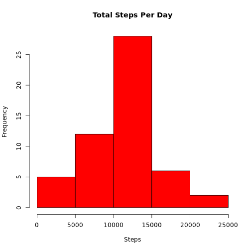

## Loading and preprocessing the data

```r
# Read the data
activity_data <- read.csv(unzip('activity.zip', 'activity.csv'))
# Add weekdays to the activity data
activity_data$date <- as.Date(activity_data$date)
activity_data$weekday <- ifelse (weekdays(activity_data$date) == "Saturday" |
                                 weekdays(activity_data$date) == "Sunday",
                                 "weekend","weekday")
activity_data$weekday <- factor(activity_data$weekday)
# Change intervals to factors
activity_data$interval_factor <- factor(activity_data$interval)
```

## What is mean total number of steps taken per day?

```r
# Clean up the activity data by removing NA values.
clean_activity_data <- activity_data[!is.na(activity_data$steps),]

# Calculate the total number of steps per day.
total_steps <- tapply(clean_activity_data$steps, clean_activity_data$date,
                      sum)

# Create a histogram of the total number of steps per day.
hist(total_steps, main="Total Steps Per Day", col="red", xlab="Steps",
     ylab="Frequency")
```

 

```r
# Calculate the mean total number of steps.
total_steps_mean <- mean(total_steps, na.rm=TRUE)

# Calculate the median total number of steps.
total_steps_median <- median(total_steps, na.rm=TRUE)
```

The mean total number of steps per day is 1.0766 &times; 10<sup>4</sup>.

The median total number of steps per day is 10765.


## What is the average daily activity pattern?

```r
average_daily_pattern <- tapply(clean_activity_data$steps,
                                clean_activity_data$interval_factor, mean)
plot(labels(average_daily_pattern)[[1]], average_daily_pattern, type='l',
     main='Average Daily Pattern', xlab='time', ylab='activity measurement')
```

 

```r
# Calculate the interval with the highest number of steps
daily_high_idx <- as.integer(which(average_daily_pattern ==
                               max(average_daily_pattern)))
daily_high <- labels(average_daily_pattern)[[1]][daily_high_idx]
```

We have computed the time interval with the most activity as 835, or 8:35 am.

## Imputing missing values

```r
missing_count <- length(activity_data$steps[is.na(activity_data$steps)])
```

There are 2304 number of missing values in the dataset.


The strategy for imputing missing values is to use the average daily activity
pattern value for that interval.


```r
# Impute the missing values.  This is not an elegant solution and could be
# improved with vectorization, but I didn't have the time to implement it.
missing_idx_list <- which(is.na(activity_data$steps))
activity_data$imputed_steps <- activity_data$steps
for (idx_ptr in seq(missing_idx_list)) {
    idx <- missing_idx_list[idx_ptr]
    known_interval <- as.character(activity_data$interval[idx])
    activity_data$imputed_steps[idx] <- average_daily_pattern[known_interval]
}

# Create the histogram with the imputed total steps per day.
total_steps_imputed <- tapply(activity_data$imputed_steps, activity_data$date,
                              sum)
hist(total_steps_imputed, main="Total Steps Per Day (imputed)", col="red",
     xlab="Steps", ylab="Frequency")
```

 

```r
imputed_mean <- mean(total_steps_imputed, na.rm=TRUE)
imputed_median <- median(total_steps_imputed, na.rm=TRUE)
```

The value of the mean total number of steps per day using imputed values
is 1.0766 &times; 10<sup>4</sup>.

The value of the median total number of steps per day using imputed values
is 1.0766 &times; 10<sup>4</sup>.

The mean and median values that were calculated using the imputed data set
are extremely similar to the values reported in the first part of the
assessment.

After imputing data, there seems to be a much higher number of days that
total between 10,000 and 15,000 steps per day.


## Are there differences in activity patterns between weekdays and weekends?

```r
par(mfrow=c(2,1))
weekday_daily_pattern <- tapply(activity_data$imputed_steps[activity_data$weekday == 'weekday'],
                                activity_data$interval_factor[activity_data$weekday == 'weekday'],
                                mean)

plot(labels(weekday_daily_pattern)[[1]], weekday_daily_pattern, type='l',
     main='Weekday Daily Pattern', xlab='time', ylab='activity measurement')

weekend_daily_pattern <- tapply(activity_data$imputed_steps[activity_data$weekday == 'weekend'],
                                activity_data$interval_factor[activity_data$weekday == 'weekend'],
                                mean)

plot(labels(weekend_daily_pattern)[[1]], weekend_daily_pattern, type='l',
     main='Weekend Daily Pattern', xlab='time', ylab='activity measurement')
```

 

Up until about 9 am or 10 am, activity levels seem to be similar.  However,
after that time, weekend activity drops to a max of 100 while weekday
activity stays high.  Both types experience a sharp dropoff of activity at
about 8 pm.
